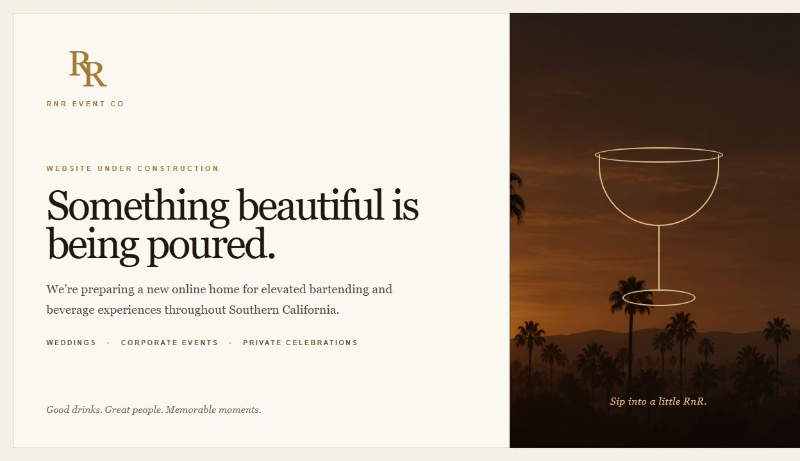
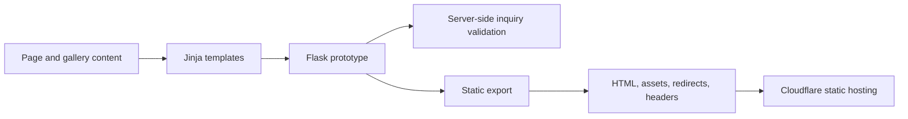

# RnR Event Co.

**A responsive website for bartending and beverage experiences in Southern California.**

[Visit rnreventco.com](https://rnreventco.com) · [Developer profile](https://github.com/kennybenny-foo)

> **Launch status:** The public domain currently displays an under-construction page. This showcase documents the website implementation in the private repository; the full site and inquiry delivery are not presented as live production features.

## Project overview

The website organizes event services for weddings, corporate events, and private celebrations around an editorial hospitality design. The implementation combines reusable page templates, responsive styling, and a structured event inquiry flow.

## Implementation highlights

- Multi-page navigation for services, event categories, gallery, about, and contact.
- Shared Jinja layouts and reusable components, with page copy and gallery data separated from rendering logic.
- Responsive CSS and a small JavaScript enhancement for mobile navigation and focus handling.
- Event inquiry fields for date, venue, guest count, glassware, contact information, and menu preferences.
- Server-side checks for required fields, email and phone formats, event dates, guest counts, allowed choices, and input lengths. Invalid submissions retain entered values and return field-specific errors.
- Custom error pages, page metadata, optional canonical URLs, security headers, and request-size limits.
- A static export path that renders Flask/Jinja pages and prepares assets, redirects, and headers for Cloudflare hosting.

## Technology

| Layer | Implementation |
| --- | --- |
| Application and validation | Python, Flask |
| Templates and content | Jinja, structured Python content definitions |
| Interface | HTML, CSS, JavaScript |
| Publishing | Python static export, Cloudflare Worker static-asset configuration |
| Automated checks | Python unittest and Flask test client |

The static export and Flask form handler are separate execution paths. Exporting HTML does not deploy the Python handler or add inquiry delivery.

## Engineering decisions

**Reusable templates with editable content.** Page content lives separately from shared layouts and components, making service copy and gallery updates possible without duplicating the page structure.

**Progressive enhancement.** The Flask prototype handles form validation on the server. JavaScript supports navigation and focus behavior, keeping essential form behavior independent of client-side scripting.

**Explicit prototype behavior.** A successful prototype submission means validation passed. It does not save an inquiry, send email, or confirm a booking. This distinction is reflected in the interface and automated checks.

**Static publishing from shared templates.** The export script uses Flask's test client to render the configured pages, checks response statuses, and emits the static files and hosting rules.

## Verification coverage

The private repository includes automated checks for routes, unique page titles, headings, internal links, image alternative text, form labels, validation errors, preserved input, HTML escaping, oversized submissions, redirects, and canonical origins. These describe the checked-in test coverage; this showcase does not claim a fresh production or accessibility audit.

## Current scope

- Public site: under-construction page at [rnreventco.com](https://rnreventco.com).
- Full website implementation: private source repository.
- Inquiry workflow: validation prototype; email delivery, persistence, and booking are not implemented in the reviewed Flask code.
- This repository contains only showcase documentation and a screenshot of the public page.
